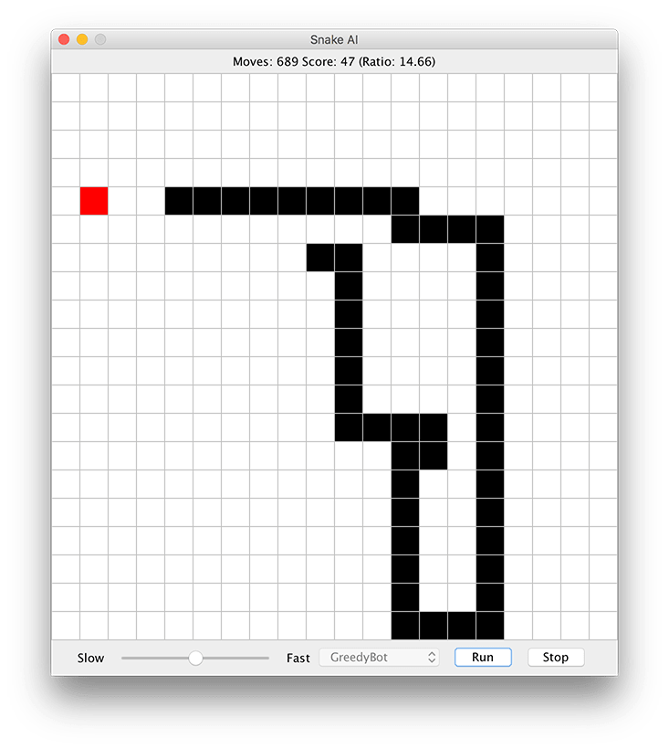

# Snake AI #

This project provides an interface that allows computer controlled
players (bots) to play [Snake](https://en.wikipedia.org/wiki/Snake_(video_game)).

## Overview ##

Running this program will display a window on which the
game automatically run and displayed on. The play speed
can be adjusted, and different bots can be selected using
the controls at the bottom (switching bots can only occur
when the game is stopped).

## Bots Strategies ##

* **RandomBot** -- Make random moves that don't collide with itself or go out of bounds.
* **BruteBot** -- Travel the same Hamiltonian cycle forever. This guarantees a win (if
the grid dimensions are even) but is quite slow in doing so.
* **GreedyBot** -- Take the shortest path to the food. If no path exists, make random
moves that don't collide with itself or go out of bounds.
* **GreedyTailBot** -- Take the shortest path to the food. If no path exists, move towards the oldest body
part that can be moved to. If the snake would reach this oldest part in fewer moves than it would
take the part to disappear, the snake will attempt to stall for time by moving to the farthest
point away from its current location.
* **SpacerBot** -- Attempt to take the shortest path to the food such that at least 1 cell of separation
is maintained between any parts of the snake and the grid boundaries. If no such path exists,
then attempt to take the shortest path to the food without the spacing restrictions. If this path
doesn't exist, make random moves that don'd collide with itself or go out or bounds.
